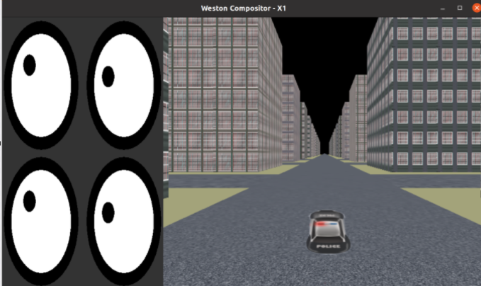
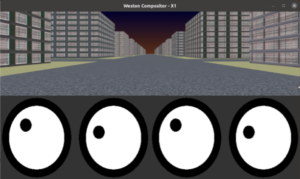

# Unified HMI IVI Window Manager (uhmi-ivi-wm)

> UnifiedHMI IVI Window Manager (uhmi-ivi-wm) is a component for controlling layers/surfaces that run on weston's ivi-shell.
> This component allows for detailed layout of layers/surfaces using the ilm API of wayland-ivi-extension.

## Contents

- [Unified HMI IVI Window Manager (uhmi-ivi-wm)](#uhmi-ivi-wm)
  - [Contents](#Contents)
  - [Repository structure](#repository-structure)
  - [How to install](#how-to-install)
    - [wayland-ivi-extention](#wayland-ivi-extention)
    - [uhmi-ivi-wm and examples](#uhmi-ivi-wm)
  - [How to Use](#how-to-use)
    - [Weston Settings](#weston-settings)
    - [Run Weston](#run-weston)
    - [Run Wayland Application](#run-wayland-application)
    - [Run uhmi-ivi-wm](#run-uhmi-ivi-wm)


## Repository Structure
```
.
├── CMakeLists.txt
├── CONTRIBUTING.md
├── LICENSE.md
├── README.md
├── app
│   ├── CMakeLists.txt
│   ├── comm_parser.c
│   ├── comm_parser.h
│   ├── comm_receiver.c
│   ├── comm_receiver.h
│   ├── ilm_control_wrapper.c
│   ├── ilm_control_wrapper.h
│   └── main.c
├── doc
│   └── png
│       ├── initcmd.png
│       └── initconf.png
└── example
    ├── CMakeLists.txt
    ├── command
    │   ├── init-config.json
    │   └── initial-screen-command.json
    └── wmsendcmd.c
```

## How-to-install
The install instructions described here are tested on Ubuntu 20.04 LTS AMD64. 
Assuming, you have a clean Ubuntu 20.04 installed, perform the following steps.

### wayland-ivi-extention 
Before building uhmi-ivi-wm, you need to install wayland-ivi-extension.
```
sudo apt-get install weston libweston-8-dev
git clone https://github.com/GENIVI/wayland-ivi-extension.git
cd wayland-ivi-extension
git checkout 2.2.3_weston_8_compatible

mkdir build
cd build
cmake ..
sudo make install
```

### uhmi-ivi-wm
```
sudo apt install libjansson-dev
git clone https://github.com/unified-hmi/uhmi-ivi-wm.git
cd uhmi-ivi-wm

mkdir build
cd build
cmake ..
sudo make install
```

## How-to-use
uhmi-ivi-wm controls the layout of surfaces running in the weston ivi-shell environment, so weston that supports ivi-shell and a Wayland app that supports ivi_application must be running.
This chapter explains how to run it using weston that supports ivi-shell on Ubuntu (default).

### Weston Settings
modify weston.ini to use ivi-shell.so.

```
[core]
shell=/<your installation path>/ivi-shell.so
modules=/<your installation path>/ivi-controller.so

[ivi-shell]
ivi-input-module=/<your installation path>/ivi-input-controller.so
```
**Note:** The wayland-ivi-extension library installation directory must be specified using an absolute path.

### Run Weston
```
weston --width=1920 height=1080 &
```

### Run Wayland Application
You can run the wayland-ivi-extension sample apps EGLWLMockNavigation and EGLWLInputEventExample to see how the layout works.
Of course it will work with other wayland apps that support ivi_application.
```
EGLWLInputEventExample &
EGLWLMockNavigation &
```

### Run uhmi-ivi-wm
uhmi-ivi-wm waits for a surface to be generated with the layout set in the initial configuration file. When a surface is detected by running a wayland app, it is automatically added to a layer and displayed.

```
uhmi-ivi-wm -c example/command/init-config.json
```



After uhmi-ivi-wm is started, you can also send layout commands via a Unix Domain Socket connection.
```
wmsendcmd -c example/command/initial-screen-command.json
```

